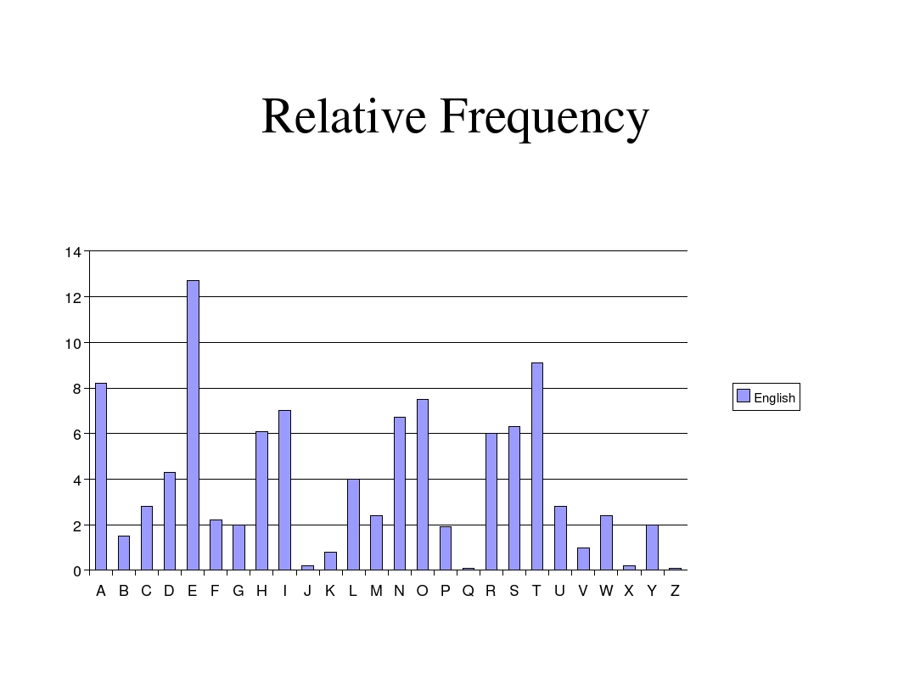

<b>Cryptography and some importants terminologies</b>

Cryptography is the practise and study of techniques for secure communication in the presence of third parties The basic concept is that there are cases when we want to make sure a given
message is read by the sender and the receiver exclusively.

There are several cases where cryptography can prove to be very important.

For example, during the second world war, the allies wanted to make sure that 
the messages can not be read by Germans So the Germans wanted to make sure that the messages can not be read by the allies So in these cases,both the allies and the Germans use cryptography in order to make sure that the
message is read by the sender and the receiver exclusively.

Of course, it is important when transferring funds electronically
It is quite intuitive that in these cases,usernames and passwords must be encrypted because we would
like to make sure that the passwords are not going to be seen any third parties.

Cryptocurrency and blockchain are quite new technologies, but there are rely heavily on cryptographhy as well
Or, for example, storing users' information in a database such as credit card passwords.
Again, we have to encrypt these information in order to make sure that these information are not going to be public for anyone.

<u>Some Important Terms</u>

👉<b>PLAINTEXT : </b> It is the message thats we want to encrypt. 
👉<b>CIPHERTEXT : </b>The encryted message. 
👉<b>ENCRYPTION :</b>The process of encoding a given message in a way that only the authorized people can access it. 
👉<b>DECRYPTION:</b>The process of decoding the message. 
👉<b>KEY:</b>This is the sequences that is needed for both encryption and decryptions. 

<u>Basically encryption and decryption are mathematical functions 
</u>

<b>Encryption:</b> cipher_text=(plain_text,key); 
<b>Decryption:</b> plain_text=f-1(cipher_text,key);
 
<b>Symmetric Encryption
</b> 
<b>PRIVATE KEY CRYPTOGRAPHY
</b>

This type of cryptography uses just a single key. So the same key is used 
both for encryption and decryption as well this is why it also called symmetric encryption

<b>⚠THE MAIN PROBLEM IS THAT THE KEY MUST BE EXCHANGED⚠
</b>

 <b>Asymmetric Encryption:</b> 
<b>PUBLIC KEY CRYPTOGRAPHY</b> 

This type of cryptography uses  a public key and a private key as well.
for this is why it is also called asymmetric encryption
👉We should keep the private key secret
👉if <b>Durjoy</b> wants to send a message to <b>Rupkotha</b> then <b>Durjoy</b> will encrypt it with
<b>Rupkotha</b>'s public key and <b>Rupkotha</b> can decrypt the message with its private key

 
<b>Symmentric Cryptography Algorithms</b>
 
👉 [Caesar-Cipher](https://en.wikipedia.org/wiki/Caesar_cipher)
 
<h2>Caesar-Cipher</h2>
<h3>Encryption</h3>
<h4>Formula behind the scane </h4>
<h3>En(x)=(x+n) mod 26</h3>
👉We have to consider all the characters in the plaintext

👉E(x) is the encrypted letter of the original x letter

👉We have to shift the given letter with n (where n is the key)

⚠Why to use 26 ? 

✅The size of alphabet is 27 which means there are 26 letter in the english alphabet

✅We want to make sure the encrypted letter is within the range[0,SIZE_ALPHABET-1] so this is why to use mod 26 here.
<h3>Decryption</h3>
<h4>Formula behind the scene</h4>
<h3>En(x)=(x-n) mod 26</h3>

👉 We have to consider all the characters in the ciphertext

👉 D(x) is the decrypted letter(x  is the letter in the ciphertext)

👉 We have to shift the given letter with -n (where n is the key)
 
**Cracking Caesar-cipher**
>The main problem with Caesar-cipher is that there are few
possible key values
~the keyspace is small: it contains 26 keys only!!
 
<b>NUMBER OF KEYS=SIZE OF THE ALPHABET</b>
 
👉 there are 26 letters in the alphabet so the number of possible keys is as well
 
👉 intuition:let's use Caesar-encryption several times (brute-force approach)
 
<b>CAESAR-CIPHER WILL NOT BE MORE SECURE IF WE REPEAT THE OPERATION</b> 
>For example: using Caesar-encryption with key 2 and then with key 3 is the same as using key 5
In our implementation we use 26 letters as the english alphabet
We Can use brute force attack in order to find the key for the Caesar-cipher

 
<b>There are 2 types of approaches to crack Caesar-cipher</b> 
1. <b>Brute-force attack</b>:because the number of possible key is 26 thats why we can consider all
   these cases (so check all the possible key values)
 
   👉 we use all the posssible key values within the range[0,SIZE_ALPHABET-1]
   and check whether the decrypted message makes sense or not
   ~it may be important to be able to detect english language 
2. <b>Frequency-analysis</b>: we can analyse the frequency distribution of the letters
   For example in an english language text some letters are more
   frequent then others(E,A,O,I and T) 
   👉 we can analyse the ciphertext and based on the most frequent letter
   in the ciphertext we can predict the key(so the number of shift)

 
<h2>Relative frequency distribution of letters in an english text</h2>
 

 
<h3>Frequency analysis cracking</h3>
<blockquote>

1. calculate the relative frequency distribution of the ciphertext's letters

2. get the most frequent letter in the ciphertext (or the second because the most frequent one may be white-spaces)

3. we can get the key based on a simple formula 

<strong>key=value of ciphertext's most frequent letter-value of E
</strong>
</blockquote>
<u>We are able to crack Caesar-cipher  because some imformation is revealed about the cryptosystem
</u>
 
<strong>THIS IS CALLED INFORMATION LEAKING!!!
</strong>
<blockquote>

👉Because of the information leaking we can analyise cipertexts and crack the given cipher 
👉Information leaking can be avoid by using <strong>random numbers</strong>
	this is why one-time-pad(OTP) came to be 

</blockquote>