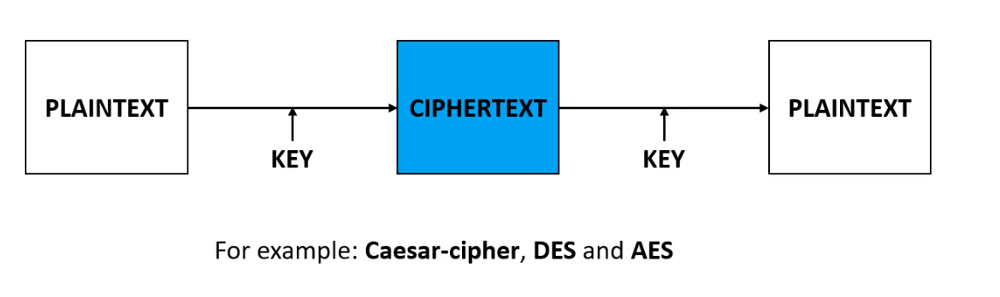
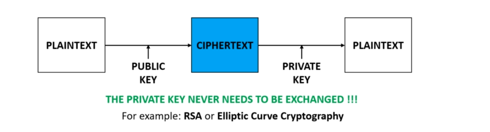

<b>Cryptography and some importants terminologies</b>

Cryptography is the practise and study of techniques for secure communication in the presence of third parties The basic concept is that there are cases when we want to make sure a given
message is read by the sender and the receiver exclusively.

There are several cases where cryptography can prove to be very important.

For example, during the second world war, the allies wanted to make sure that 
the messages can not be read by Germans So the Germans wanted to make sure that the messages can not be read by the allies So in these cases,both the allies and the Germans use cryptography in order to make sure that the
message is read by the sender and the receiver exclusively.

Of course, it is important when transferring funds electronically
It is quite intuitive that in these cases,usernames and passwords must be encrypted because we would
like to make sure that the passwords are not going to be seen any third parties.

Cryptocurrency and blockchain are quite new technologies, but there are rely heavily on cryptographhy as well
Or, for example, storing users' information in a database such as credit card passwords.
Again, we have to encrypt these information in order to make sure that these information are not going to be public for anyone.

<u>Some Important Terms</u>

👉<b>PLAINTEXT : </b> It is the message thats we want to encrypt. 
👉<b>CIPHERTEXT : </b>The encryted message. 
👉<b>ENCRYPTION :</b>The process of encoding a given message in a way that only the authorized people can access it. 
👉<b>DECRYPTION:</b>The process of decoding the message. 
👉<b>KEY:</b>This is the sequences that is needed for both encryption and decryptions. 

<u>Basically encryption and decryption are mathematical functions 
</u>

<b>Encryption:</b> cipher_text=(plain_text,key); 
<b>Decryption:</b> plain_text=f-1(cipher_text,key);
 
<b>Symmetric Encryption
</b> 
<b>PRIVATE KEY CRYPTOGRAPHY
</b>

This type of cryptography uses just a single key. So the same key is used 
both for encryption and decryption as well this is why it also called symmetric encryption

<b>⚠THE MAIN PROBLEM IS THAT THE KEY MUST BE EXCHANGED⚠
</b>

 <b>Asymmetric Encryption:</b> 
<b>PUBLIC KEY CRYPTOGRAPHY</b> 

This type of cryptography uses  a public key and a private key as well.
for this is why it is also called asymmetric encryption
👉We should keep the private key secret
👉if <b>Durjoy</b> wants to send a message to <b>Rupkotha</b> then <b>Durjoy</b> will encrypt it with
<b>Rupkotha</b>'s public key and <b>Rupkotha</b> can decrypt the message with its private key

 
<b>Symmentric Cryptography Algorithms</b>
 
👉 [Caesar-Cipher](https://en.wikipedia.org/wiki/Caesar_cipher#:~:text=The%20Caesar%20cipher%20is%20named%20after%20Julius%20Caesar%2C%20who%2C%20according,protect%20messages%20of%20military%20significance.)